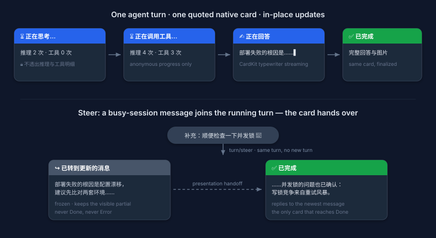

<div align="center">


**为飞书做到极致的本机 AI 编程 Agent 遥控台 —— 同时支持 Telegram、Slack、Discord 等 14 个平台。**

[CC Connect](https://github.com/chenhg5/cc-connect) 的隐私优先独立后继：原生飞书 Card 2.0 回答生命周期、回合中途并入（steer）、可审计的一键迁移。

[](https://github.com/timmyagentic/cc-connect-next/releases/latest)
[](https://www.npmjs.com/package/cc-connect-next)
[](LICENSE)
[](go.mod)
[](#-支持的-agent-与平台)
[](#-支持的-agent-与平台)

[English](README.en.md) · [安装文档](INSTALL.md) · [使用指南](docs/usage.zh-CN.md) · [飞书配置](docs/feishu.md) · [迁移指南](docs/migration.zh-CN.md)



</div>

---

把 Claude Code、Codex、Cursor 等 14 种编程 Agent 跑在自己的机器上，然后用口袋里的聊天软件驱动它们。cc-connect-next 是单个 Go 二进制：不是 MCP、代理、伴生插件或消息快照方案，也不要求官方 CC Connect 做任何修改；它拥有自己的命令、数据目录、daemon 和 npm 包，可与官方版本并存。

## ✨ 亮点

- 🔒 **隐私优先的飞书 Card 2.0 生命周期** —— 一次 Agent 回合始终是同一张引用原始提问的原生卡片：`⏳ 正在思考` → `⏳ 正在调用工具` → `✍️ 正在回答`（CardKit 打字机流式）→ `✅ 已完成`。处理中只渲染匿名进度计数；推理文本、工具名称、参数、结果、模型、token、工作目录在**两层**被丢弃，卡片中不存在可展开面板。最终回答正文会正常发送到飞书，因此其中引用的代码或 patch 也会经过飞书。
- 🎛️ **并入正在执行的回合（steer）** —— 忙时消息默认直接并入**正在运行**的任务（Codex 原生 `turn/steer`），进度卡片同步交接到最新消息；不支持该能力的 agent 透明回退到 FIFO 队列，`busy_message_mode = "queue"` 可恢复始终排队。`/ps` 在任何模式下都是显式 steer。
- 🚚 **可审计的一键迁移** —— `cc-connect-next migrate` 清点官方安装、对每个源文件计算哈希、staging 构建校验后原子启用，附带时间戳备份和完整 SHA-256 manifest；宁可安全失败也绝不启用不完整的目标。
- 🪶 **同一个机器人，开箱即用的官方 lark-cli** —— 新装与迁移可直接安装官方 `lark-cli`，复用 Next 已验证的飞书机器人，创建或复用隔离 profile，并把它设为默认 bot profile；旧 profile、用户 OAuth 与密钥边界完整保留。
- 🔔 **自我维护的安装** —— `cc-connect-next update` 只走稳定通道；独立二进制使用 Foundation 的 immutable Plan、同 Release checksum、双版本探针、锁、备份与回滚，npm/Windows 保留显式宿主 adapter。daemon 对每个新稳定版只提醒一次；点击【查看并更新】或回复「更新」先展示精确 Release/产物，再确认安装，不会批准 A 却安装 B。
- 🤖 **14 种 Agent × 15 个平台** —— 单进程承载多个项目，每个项目把一个代码目录绑定到独立的 Agent 与平台，各自拥有权限、provider、模型与展示配置。
- 🌍 **生产级配套** —— `doctor` 诊断、launchd/systemd/Windows daemon、Web 管理台（Beta）、定时任务与 webhook、机器人间 relay、语音输入/输出（STT/TTS）、多工作区路由，五语言 i18n（en、zh、zh-TW、ja、es）。

- **可审阅的一句话反馈。** 遇到 bug 或缺失能力时，`/feedback` 先展示 Foundation 生成的完整脱敏预览；只有独立的提交按钮或 `confirm` 才会发送同一份草稿。作者侧 Relay 固定目标仓库并渲染 Issue，无需 GitHub 账号，取消和未批准始终零请求。

## 🎬 实际效果

<div align="center">

</div>

在 steer 模式下（或使用 `/ps`）回合中途发来的补充,会并入**同一个** Agent 回合——不开新回合、不起并发进程。旧卡片冻结为中性灰色的「已转到更新的消息」状态并保留已经可见的内容,后续进度与最终回答只渲染在回复最新消息的卡片中。一个回合有且只有一张卡片到达完成态。

## 🥇 飞书是一等公民

多数桥接工具是把 Telegram 机器人移植到飞书，做到「能发消息」为止。cc-connect-next 反过来：飞书是基准平台，集成行为由一份可执行的[回答卡片契约](docs/feishu-card-contract.md)约束，吃透了平台的高级能力面。如果你的团队生活在飞书里，这些是每天都能感受到的差别：

- **卡片是工程出来的** —— CardKit 打字机流式带单调序号（迟到的帧永远覆盖不了更新的内容），一次性吐出的答案也有 ≥900ms 的「正在回答」停留，让流式动画可感知；CardKit 不可用时自动回退为原地卡片更新；超出飞书组件预算的表格在同一张卡片里降级为代码块，而不是溢出成多条消息；终态更新失败时回退为一张可追踪的替换卡——绝不退化成不可管理的多段回复。`NO_REPLY` 会撤回乐观卡片；你撤回提问时卡片静默删除、半成品不进入会话历史；`done_emoji` 只在可见的成功回答之后才给你的消息贴表情。
- **@ 是真的能通知到人** —— 回答中的 `@显示名` 解析为飞书原生 at（懒加载群成员、缓存 1 小时、按名字长度优先匹配；`mention_map` 支持 @ 其他机器人并校验 `ou_` ID）。而卡片里的 at 只展示、不通知——所以含已解析 at 的最终答案会改用可追踪的引用文本消息发出（真正触发通知），再删除过程卡。
- **话题与群聊做对了** —— `thread_isolation = "topics_only"` 只给飞书明确标记的真实话题独立 session 和工作区绑定；在群主会话里直接 @ 机器人仍原地回复，不会自动创建话题。需要“每条群消息一个话题”的团队可以改用 `topic_per_message`。在已有话题里第一次 @ 机器人会按顺序回填触发消息的有界 parent/reply 链（最多 5 条，不包含完整话题或兄弟回复历史）。`group_reply_all_chats` 支持按群指定免 @ 名单，并把 `im:message.group_msg` 权限的确切边界写清楚。引用文件下载有双重门禁：必须显式 @ 机器人，且被引用文件的上传者就是当前提问的人。话题里发起的 Relay 提示留在原话题，不泄漏到群根会话。
- **运维不添乱** —— WebSocket 长连接（不需要公网 IP、域名、证书）自动重连；权限确认、provider/模型切换都用交互卡片完成；远程 markdown 图片上传一次按 URL 复用、失败进入一分钟退避，连续多图自动合批；`cc-connect-next feishu setup` 交互式配置内置推荐档并可绑定官方 `lark-cli`；每回合快照语言环境，五种语言完整 i18n。

以上每一条，要么是[飞书指南](docs/feishu.md)里有文档的配置项，要么是[卡片契约](docs/feishu-card-contract.md)里有测试保障的行为——不是营销话术。

## 🚀 快速开始

```bash
# 1. 安装（macOS / Linux / Windows，amd64 与 arm64）
npm install -g cc-connect-next

# 2. 生成启动配置并填入 REPLACE 值
cc-connect-next                # 生成 ~/.cc-connect-next/config.toml 并给出指引
cc-connect-next feishu setup   # 配置飞书，并可复用机器人安装/默认绑定官方 lark-cli

# 3. 校验并运行
cc-connect-next doctor
cc-connect-next
```

只要还有 `REPLACE` 占位符没替换，启动就会拒绝执行并指名是哪个键、下一步该做什么——而不是先自称运行正常、再连不上。`doctor` 检查配置、Agent 命令行及登录态、平台、依赖与网络，全程不建立平台连接。

不知道当前项目能做什么、怎样调用、是否可用或能否配置时，直接用自然语言问连接的 Agent。Agent 会查询当前版本/项目/会话的只读
[Agent Capability Manifest](docs/agent-capability-manifest.zh-CN.md)，其中统一包含配置、CLI 工具、聊天命令、Skills、运行态适配器能力、参数、权限、副作用、退化行为和可用性原因；也可以手动运行
`cc-connect-next capabilities --search "关键词"`。只查配置时仍可使用 `cc-connect-next config capabilities --search "关键词"`，完整逐项说明见[配置能力参考](docs/configuration.zh-CN.md)。
Feedback 与 Update 的 Foundation/宿主职责、精确 Plan 和 Relay 边界见
[Awesome Agent App Features 接入说明](docs/agent-app-features.zh-CN.md)。

跑通后安装为系统服务：

```bash
cc-connect-next daemon install --config ~/.cc-connect-next/config.toml
```

独立二进制、源码构建与更新细节见 [INSTALL.md](INSTALL.md)。

## 🎛️ 排队 vs 并入（steer）

忙时消息背后有两种不同的意图——它们是两个不同的功能：

| | `steer`（默认） | `queue` |
|---|---|---|
| 语义 | “把这条纠正并入**正在运行**的任务” | “先做完当前任务，再把这条当作新请求” |
| 机制 | 原生 `turn/steer` 锁定当前回合（`expectedTurnId`） | 会话级 FIFO，当前回合结束后开新回合 |
| 卡片行为 | 进行中的卡片交接到最新消息 | 排队回合开始时创建新卡片 |
| 要求 | Codex（默认 app-server/stdio 后端；其余回退排队） | 任意 Agent |

```toml
[queue]
busy_message_mode = "steer"     # "steer"（默认）或 "queue"

[projects.agent.options]
backend = "app_server"
app_server_url = "stdio"
```

`/ps <消息>`（别名 `/btw`）无论配置为何都始终显式 steer。确定性的失败会安全回退；结果未知时绝不自动重投，你的输入永远不会被投递两次。详见[使用指南](docs/usage.zh-CN.md#忙时消息排队-vs-并入steer)。

## 🧩 支持的 Agent 与平台

| | |
|---|---|
| **Agent** | Claude Code · Codex · Cursor · Gemini CLI · GitHub Copilot CLI · Kimi Code · OpenCode · iFlow · Qoder · Pi · Devin · Antigravity · 通用 ACP · tmux |
| **平台** | 飞书/Lark · Telegram · Slack · Discord · 钉钉 · 企业微信 · 微信个人号 · QQ · QQ 机器人 · LINE · 微博 · Matrix · Webex · MAX · WPS 协作，另有 WebSocket [Bridge](docs/bridge-protocol.zh-CN.md) 支持外部自定义适配器 |

所有 Agent 与平台默认全部编译，可用构建标签裁剪（`make build EXCLUDE=discord,qq`）。

## 🏗️ 架构

```
┌───────────────────────────────────────────────┐
│                cmd/cc-connect                 │  CLI · daemon · migrate · update · doctor
├───────────────────────────────────────────────┤
│                    core/                      │  engine · 会话 · 卡片 · steer ·
│        （只依赖标准库，绝不依赖插件）           │  队列 · i18n · cron · webhook · relay
├──────────────────────┬────────────────────────┤
│       agent/*        │      platform/*        │  自包含适配器，
│  claudecode codex …  │  feishu telegram …     │  通过能力接口注册
└──────────────────────┴────────────────────────┘
```

core 从不硬编码任何 Agent 或平台名称；富卡片、steer、模型切换等可选能力都是适配器主动实现的接口断言。一个进程可承载任意数量的 `[[projects]]`。

## 🔄 从官方 CC Connect 迁移

```bash
cc-connect-next migrate --dry-run   # 先查看完整迁移计划
cc-connect-next migrate --switch    # 停官方服务、最终同步并启动 Next；交互式提供 lark-cli
cc-connect-next daemon status
```

不需要申请第二个飞书应用。`--switch` 从官方 daemon 生命周期之外的终端执行；已连接的 CC Agent 会话会在停服前拒绝。命令要求没有已安装的 Next 服务，随后停止并禁用官方 daemon、完成最终一致性迁移，再用迁移配置与官方原运行目录安装并启动 Next。它会继续等待本地 API 和所有配置平台真实 Ready，之后才由 CLI 用迁移后的飞书/Lark 机器人向唯一或显式操作者私聊“迁移完成，cc-connect-next 已运行”。激活失败时，只有 Next 服务已解除注册、runtime socket 不再应答且迁移配置锁已释放，才恢复官方服务；否则保持官方禁用，避免双消费者。目标有歧义或发送失败不会误发群聊，也不会回滚成功迁移。`daemon status` 会分别显示 Service 与 Runtime/Platforms。交互终端随后提供官方 `lark-cli` companion，脚本使用 `--lark-cli` 显式启用；多个机器人用 `--lark-cli-project` 选择，迁移 dry-run 永不写入 lark-cli。官方 binary 和数据始终保留。

双跑冲突由产品层兜底：官方 daemon 还在使用相同飞书凭证时，cc-connect-next 会**拒绝启动**而不是重复消费消息；`doctor` 也会报告共存状态。只复制、不切换服务的 `cc-connect-next migrate` 仍保留给备份和高级并行试用场景。

📖 **[完整迁移与共存指南](docs/migration.zh-CN.md)** —— 自定义路径、兼容矩阵、服务切换、回滚，以及可直接交给 Agent 执行的任务块。

## ⚙️ 推荐飞书配置

新配置已默认使用这些值（`cc-connect-next feishu setup` 套用同一份预设）：

```toml
[display]
mode = "compact"
card_mode = "rich"          # 改为 "legacy" 可回到继承自 CC Connect 的消息渲染
thinking_messages = false
tool_messages = false
show_context_indicator = false
reply_footer = true
hide_agent_footer = true

[[projects]]
name = "my-project"

[projects.agent]
type = "codex"

[projects.agent.options]
work_dir = "/absolute/path/to/project"
mode = "yolo"

[[projects.platforms]]
type = "feishu"

[projects.platforms.options]
app_id = "${FEISHU_APP_ID}"
app_secret = "${FEISHU_APP_SECRET}"
reply_to_trigger = true
thread_isolation = "topics_only"
done_emoji = "Done"
```

精确的生命周期、隐私边界、退化行为与验证命令定义在[回答卡片契约](docs/feishu-card-contract.md)。

## 🆚 对比官方 CC Connect

cc-connect-next 从 CC Connect v1.4.1 分叉，通过逐项审计而非整体合并跟进上游（[审计策略与历史](docs/upstream-v1.5.0-beta.3-audit.md)）。正在用官方版本？完整的长文——真正的差异、直接迁移与安全回滚——见 **[写给官方 CC Connect 用户](docs/coming-from-cc-connect.zh-CN.md)**。

| | CC Connect | cc-connect-next |
|---|---|---|
| 飞书回答 | 消息流 / legacy 卡片 | 单卡片 Card 2.0 生命周期 + 打字机流式 |
| 聊天中的推理/工具明细 | 会渲染 | 只有匿名计数，两层强制丢弃 |
| 忙时消息 | 仅 FIFO 排队；`/ps` 裸发送 | 默认原生 steer + 卡片交接，可配置排队 |
| 更新 | 手动 | 稳定通道更新器 + daemon 每版本一次的主动提醒 |
| 迁移路径 | — | 带 manifest 与回滚的可审计一键迁移 |
| 运行时身份 | `cc-connect` · `~/.cc-connect` | 全部独立，可并存 |

## 📚 文档

| 指南 | 内容 |
|---|---|
| [INSTALL.md](INSTALL.md) | npm / 独立二进制 / 源码安装、更新、daemon |
| [使用指南](docs/usage.zh-CN.md) | 会话、排队 vs steer、权限、provider、模型、cron、relay、语音 |
| [Agent Capability Manifest](docs/agent-capability-manifest.zh-CN.md) | Agent 可查询的统一能力、权限、副作用、退化与运行态可用性契约 |
| [飞书配置](docs/feishu.md) | 应用创建、权限、事件订阅 |
| [回答卡片契约](docs/feishu-card-contract.md) | 卡片生命周期与隐私保证的精确定义 |
| [写给官方 CC Connect 用户](docs/coming-from-cc-connect.zh-CN.md) | 诚实对比、直接迁移与安全回滚 |
| [迁移指南](docs/migration.zh-CN.md) | 迁移、共存与切换的完整参考 |
| [迁移兼容矩阵](docs/migration-compatibility.md) | 哪些官方版本与配置可迁移 |
| [Bridge 协议](docs/bridge-protocol.zh-CN.md) | 通过 WebSocket 编写自定义平台适配器 |
| [管理 API](docs/management-api.zh-CN.md) | 本地 HTTP 控制面 |
| 平台指南 | [Telegram](docs/telegram.md) · [Slack](docs/slack.md) · [Discord](docs/discord.md) · [钉钉](docs/dingtalk.md) · [企业微信](docs/wecom.md) · [QQ](docs/qq.md) · [Matrix](docs/matrix.zh-CN.md) · [更多](docs/) |

## 🛠️ 开发与验证

```bash
make web            # 构建一次 Web 管理台资源
go test ./...       # 全量测试
make build-noweb    # 不含 Web 面板的快速构建
```

定向套件：`go test ./platform/feishu -run TestBuildRichCard`、`go test ./core -run TestCUJ_Steer`、`go test -tags no_web ./cmd/cc-connect -run TestMigrateLegacyData`。贡献遵循 [AGENTS.md](AGENTS.md) 的分层规则：core 不反向依赖 agent/platform、适配器按能力接口注册、所有用户可见文案五语言齐全、新功能必须附带回归测试。

## 🙏 来源与许可证

cc-connect-next 始于 CC Connect v1.4.1 并完整保留其 Git 历史——感谢 [@chenhg5](https://github.com/chenhg5) 与所有上游贡献者。上游改动通过逐项审计引入并在审计日志中注明出处。归属声明见 [NOTICE](NOTICE)，MIT 许可条款见 [LICENSE](LICENSE)。
